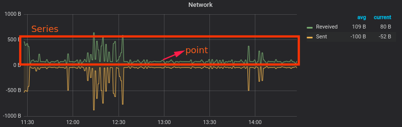

# concepts 

| InfluxDB        | RDB           |
| ----------------| -------------:|
| database        | database      | 
| measurement     | table         | 
| point           | record        | 
| tag             | indexed column| 
| field           | column        | 

- measurement
    - Conceptually you can think of a measurement as an SQL table, where the primary index is always time.
- point
    - the point is a `point` on the graph
    - a point consists of
        - a measurement ("network_received" or "network_sent")
        - timestamp
            - UTC time internally
            - nanosecond time precision
        - tags
            - key value pair to work as index(for searching or grouping)
        - fields
            - key value pair to keep the data
    - format of point
        - <measurement> [,tagkey=tagvalue...] fieldkey1=fieldvalue1 ... ts
- series
    - a series is a collection of points sharing the same measurement, tags and retention policy.
- retention policy
    - describes how long InfluxDB keeps data (DURATION) 
        - shard group duration
            - the shard group duration is determined by the retention policy’s DURATION
                - `RP DURATION: < 2 days` -> `Shard Group Duration: 1 hour`
                - `RP DURATION: >= 2 days and <= 6 months` -> `Shard Group Duration: 1 day`
                - `RP DURATION: > 6 months` -> `Shard Group Duration: 7 days`
    - describes how many copies of this data is stored in the cluster (REPLICATION)
        - it equals the number of data nodes
        - to ensure data is immediately available for queries, set the replication factor n to less than or equal to the number of data nodes in the cluster
    - A single measurement can belong to different retention policies
    - the default policy is `autogen`, which has an infinite duration and a replication factor set to one
# Samples to illustrate the concepts

points
```
weather,country=cn,city=beijing temp=25.1 humanity=9 1472515200000000000
weather,country=cn,city=beijing temp=26.1 humanity=9 1472515200000003400
weather,country=cn,city=beijing temp=24.1 humanity=8 1472515200000006800
weather,country=cn,city=shanghai temp=30.0 humanity=11 1472515200000000001
weather,country=cn,city=shanghai temp=31.0 humanity=11 1472515200000000778
weather,country=us,city=newyork temp=23.7 humanity=8 1472515200000000003
weather,country=us,city=newyork temp=27.7 humanity=4 1472515200000000056
weather,country=us,city=seattle temp=27.9 humanity=10 14725152000000000000
weather,country=us,city=seattle temp=27.9 humanity=10 14725152000000000022
```

- measurement
    -  `weather`
- timestamp
    - the `147251520000000xxxx`
- tags
    - `country=x`
    - `city=x`
- fields
    - `temp=x`
    -  `humanity=x`
- series
    - there are 4 series in the above sample data
        - autogen weather,country=cn,city=beijing
        - autogen weather,country=cn,city=shanghai
        - autogen weather,country=us,city=newyork
        - autogen weather,country=us,city=seattle




# Programming

java
``` java
String database = "";
String policyName = "";
String measurementName = "";
long timestamp;
TimeUnit timeUnit;
Map<String, String> tags;
Map<String, Object> fields;

Point point = Point.measurement(measurementName).time(timestamp, timeUnit).tag(tags).fields(fields).build();
influxDB.write(database, policyName, point);


```

InfluxQL
``` sql
-- create database
-- creates a database called weather with a DURATION of three days, a replication factor of 3, a shard group duration of one hour, and with the name w
CREATE DATABASE "weather" WITH DURATION 3d REPLICATION 3 SHARD DURATION 1h NAME "w"
DROP DATABASE "weather"

-- show data
SELECT "temp" FROM "weather" WHERE "contry" ='cn' AND "city" ='shanghai' AND time >= 1574139694363ms and time <= 1574150160710ms
-- show the value of 95% temp
SELECT percentile("temp", 95) FROM "weather" WHERE "contry" ='cn' AND "city" ='shanghai' AND time >= 1574139694363ms and time <= 1574150160710ms
-- how many received points 
SELECT count("temp") FROM "weather" WHERE "contry" ='cn' AND "city" ='shanghai' AND time >= 1574139694363ms and time <= 1574150160710ms
-- the average temp
SELECT mean("temp") FROM "weather" WHERE "contry" ='cn' AND "city" ='shanghai' AND time >= 1574139694363ms and time <= 1574150160710ms GROUP BY time(5m)

-- delete all series from measurement
DELETE from "weather" 
-- delete series from measurement by tag
DELETE from "weather" where "country" = "us"
-- delete series from the entire database
DELETE WHERE time < '2019-01-01'

-- drop series
-- drop all points of specific tag, the index will also be droped
DROP SERIES FROM "weather" WHERE "country"='us'


CREATE RETENTION POLICY "one_day_only" ON "weather" DURATION 1d REPLICATION 2
DROP RETENTION POLICY "one_day_only" ON  "weather"

reference: https://docs.influxdata.com/influxdb/v1.7/query_language/functions/


# index management

- in-momory index
    - index data is stored in memory
    - it requires a lot of RAM. This upper bound is usually somewhere between 1 - 4 million series depending on the machine used.
- time series index(TSI)
    - TSI stores index data on disk
    - TSI uses the operating system’s page cache to pull hot data into memory.

### in memory index

```
index-version = "inmem"
max-series-per-database = 1000000
max-values-per-tag = 100000
```
- max-series-per-database
    - the maximum allowable series count per __database__
    - by default, it is set to 1 million
    - `max series per database exceeded` error occurs when a write causes the number of series exceed this number
        - change to `0` to allows an unlimited number of series per database.
        - to avoid this, avoid using UUID, timestamp or random values as tag values
- max-values-per-tag
    - the maximum allowable tag value count per __tag__
    - by default, it is set to 100000
    - `max values per tag limit exceeded InfluxDB` error occurs when  a write causes the number of tag values exceed this number
        - change to `0` to allows an unlimited number of values per tag.
        - to avoid this, avoid using UUID, timestamp or random values as tag values
    
### TSI

```
index-version = "tsi1"
max-index-log-file-size = "1m"
```
- max-index-log-file-size
    - when an index write-ahead log (WAL) file will compact into an index file
    - Lower sizes will cause log files to be compacted more quickly and result in lower heap usage at the expense of write throughput.
    - Higher sizes will be compacted less frequently, store more series in-memory, and provide higher write throughput. 


# different from RDB

- time series data is generally written once and rarely updated
- schema
    - no need to define the schema
    - timestamp is always the primary key
    - cannot rename tag name, to rename a tag name, just create a new tag name
    - tags cannot be deleted by tag key or tag value
- search
    - join is not allowed
    - more useful in the aggregate
- update a point
    - to update a point, insert one with the same measurement, tag set, and timestamp.
- delete a point
    - point cannot be deleted by field values, but can be deleted by timestamps
