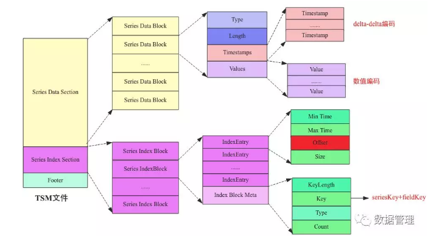
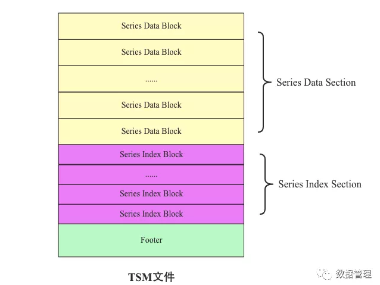
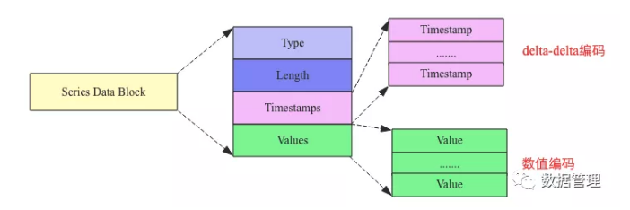
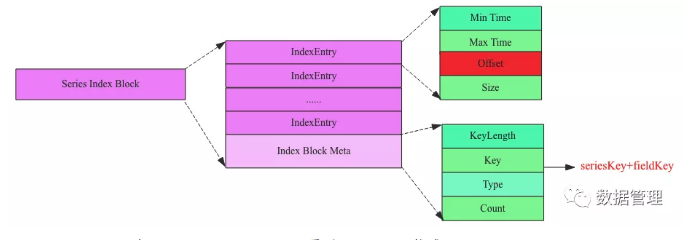
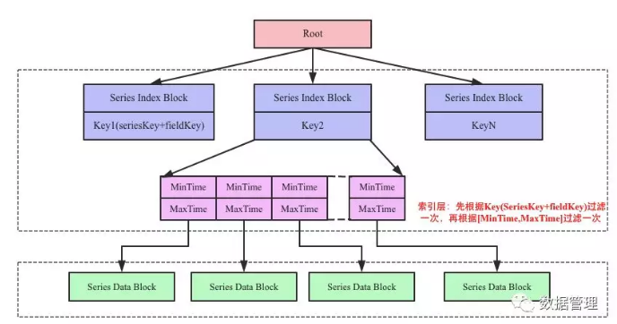

# concepts 

it is a NoSql.

| InfluxDB        | RDB           |
| ----------------| -------------:|
| database        | database      | 
| measurement     | table         | 
| point           | record        | 
| tag             | indexed column| 
| field           | column        | 

- measurement
    - Conceptually you can think of a measurement as an SQL table, where the primary index is always time.
- point
    - the point is a `point` on the graph
    - a point consists of
        - a measurement ("network_received" or "network_sent")
        - timestamp
            - UTC time internally
            - nanosecond time precision
        - tags
            - key value pair to work as index(for searching or grouping)
        - fields
            - key value pair to keep the data
    - format of point
        - <measurement> [,tagkey=tagvalue...] fieldkey1=fieldvalue1 ... ts
- series
    - a series is a collection of points sharing the same measurement, tags and retention policy.
- retention policy
    - describes how long InfluxDB keeps data (DURATION) 
        - shard group duration
            - the shard group duration is determined by the retention policy’s DURATION
                - `RP DURATION: < 2 days` -> `Shard Group Duration: 1 hour`
                - `RP DURATION: >= 2 days and <= 6 months` -> `Shard Group Duration: 1 day`
                - `RP DURATION: > 6 months` -> `Shard Group Duration: 7 days`
    - describes how many copies of this data is stored in the cluster (REPLICATION)
        - it equals the number of data nodes
        - to ensure data is immediately available for queries, set the replication factor n to less than or equal to the number of data nodes in the cluster
    - A single measurement can belong to different retention policies
    - the default policy is `autogen`, which has an infinite duration and a replication factor set to one
# Samples to illustrate the concepts

points
```
weather,country=cn,city=beijing temp=25.1 humanity=9 1472515200000000000
weather,country=cn,city=beijing temp=26.1 humanity=9 1472515200000003400
weather,country=cn,city=beijing temp=24.1 humanity=8 1472515200000006800
weather,country=cn,city=shanghai temp=30.0 humanity=11 1472515200000000001
weather,country=cn,city=shanghai temp=31.0 humanity=11 1472515200000000778
weather,country=us,city=newyork temp=23.7 humanity=8 1472515200000000003
weather,country=us,city=newyork temp=27.7 humanity=4 1472515200000000056
weather,country=us,city=seattle temp=27.9 humanity=10 14725152000000000000
weather,country=us,city=seattle temp=27.9 humanity=10 14725152000000000022
```

- measurement
    -  `weather`
- timestamp
    - the `147251520000000xxxx`
- tags
    - `country=x`
    - `city=x`
- fields
    - `temp=x`
    -  `humanity=x`
- series
    - there are 4 series in the above sample data
        - autogen weather,country=cn,city=beijing
        - autogen weather,country=cn,city=shanghai
        - autogen weather,country=us,city=newyork
        - autogen weather,country=us,city=seattle


# Programming

java
``` java
String database = "";
String policyName = "";
String measurementName = "";
long timestamp;
TimeUnit timeUnit;
Map<String, String> tags;
Map<String, Object> fields;

Point point = Point.measurement(measurementName).time(timestamp, timeUnit).tag(tags).fields(fields).build();
influxDB.write(database, policyName, point);


```

InfluxQL
``` sql
-- create database
-- creates a database called weather with a DURATION of three days, a replication factor of 3, a shard group duration of one hour, and with the name w
CREATE DATABASE "weather" WITH DURATION 3d REPLICATION 3 SHARD DURATION 1h NAME "w"
DROP DATABASE "weather"

-- show data
SELECT "temp" FROM "weather" WHERE "contry" ='cn' AND "city" ='shanghai' AND time >= 1574139694363ms and time <= 1574150160710ms
-- show the value of 95% temp
SELECT percentile("temp", 95) FROM "weather" WHERE "contry" ='cn' AND "city" ='shanghai' AND time >= 1574139694363ms and time <= 1574150160710ms
-- how many received points 
SELECT count("temp") FROM "weather" WHERE "contry" ='cn' AND "city" ='shanghai' AND time >= 1574139694363ms and time <= 1574150160710ms
-- the average temp
SELECT mean("temp") FROM "weather" WHERE "contry" ='cn' AND "city" ='shanghai' AND time >= 1574139694363ms and time <= 1574150160710ms GROUP BY time(5m)

-- delete all series from measurement
DELETE from "weather" 
-- delete series from measurement by tag
DELETE from "weather" where "country" = "us"
-- delete series from the entire database
DELETE WHERE time < '2019-01-01'

-- drop series
-- drop all points of specific tag, the index will also be droped
DROP SERIES FROM "weather" WHERE "country"='us'


CREATE RETENTION POLICY "one_day_only" ON "weather" DURATION 1d REPLICATION 2
DROP RETENTION POLICY "one_day_only" ON  "weather"

reference: https://docs.influxdata.com/influxdb/v1.7/query_language/functions/
```

# index management

- in-momory index
    - index data is stored in memory
    - it requires a lot of RAM. This upper bound is usually somewhere between 1 - 4 million series depending on the machine used.
- time series index(TSI)
    - TSI stores index data on disk
    - TSI uses the operating system’s page cache to pull hot data into memory.

### in memory index

```
index-version = "inmem"
max-series-per-database = 1000000
max-values-per-tag = 100000
```
- max-series-per-database
    - the maximum allowable series count per __database__
    - by default, it is set to 1 million
    - `max series per database exceeded` error occurs when a write causes the number of series exceed this number
        - change to `0` to allows an unlimited number of series per database.
        - to avoid this, avoid using UUID, timestamp or random values as tag values
- max-values-per-tag
    - the maximum allowable tag value count per __tag__
    - by default, it is set to 100000
    - `max values per tag limit exceeded InfluxDB` error occurs when  a write causes the number of tag values exceed this number
        - change to `0` to allows an unlimited number of values per tag.
        - to avoid this, avoid using UUID, timestamp or random values as tag values
    
### TSI

```
index-version = "tsi1"
max-index-log-file-size = "1m"
```
- max-index-log-file-size
    - when an index write-ahead log (WAL) file will compact into an index file
    - Lower sizes will cause log files to be compacted more quickly and result in lower heap usage at the expense of write throughput.
    - Higher sizes will be compacted less frequently, store more series in-memory, and provide higher write throughput. 


# different usage from RDB

- time series data is generally written once and rarely updated
- schema
    - no need to define the schema
    - timestamp is always the primary key
    - cannot rename tag name, to rename a tag name, just create a new tag name
    - tags cannot be deleted by tag key or tag value
- search
    - join is not allowed
    - more useful in the aggregate
- update a point
    - to update a point, insert one with the same measurement, tag set, and timestamp.
- delete a point
    - point cannot be deleted by field values, but can be deleted by timestamps


# Storage Engine Component

- in-memory index
- WAL
    - allows for writes to be durable, but not easily queryable.
    - writes to the WAL are appended to segments of a fixed size.
    - organized as a bunch of files that look like _000001.wal
        - file numbers are increasing and referred to as WAL segments
        - when a segment reaches 10MB in size, it is closed and a new one is opened.
- Cache
    - it is an in-memory representation of the data stored in the WAL.
    - queries to the storage engine will merge data from the Cache with data from the TSM files. 
    - Cache is recreated on restart by re-reading the WAL files on disk.
- TSM(Time-Structured Merge Tree)
    - store compressed series data in a columnar format
    - it is similar to LSM(Log Structrued Merge) tree
- FileStore
    - The FileStore mediates access to all TSM files on disk. 
    - It ensures that TSM files are installed atomically when existing ones are replaced as well as removing TSM files that are no longer used.
- Compactor
    - compressing series, removing deleted data, optimizing indices and combining smaller files into larger ones.
- Compaction Planner 
    - The Compaction Planner determines which TSM files are ready for a compaction and ensures that multiple concurrent compactions do not interfere with each other.
- Compression
    - handled by various Encoders and Decoders for specific data types.
- Writers/Readers 
    - read or write each file type (WAL segment, TSM files, tombstones, etc..)


# InfluxDB vs RDB: can RDB be used as time series DB?

time series database should be able to accept a `continuous` `large` number QPS

there are very less query opertions than write operations, but it should be quick to aggreate the data while query.

- schema
    - influxDB don't need to define schema, it is flexbile to add tags and fileds on the air
    - for RDB, the schema must be defined first, if we want to add tags or fields, we have to alter the schema
- data write: 
    - there won't too much performance difference on data writes
        - InfluxDB append the new data in the memory
            - InfluxDB use TSM(which is similar to LSM tree) tree, LSM is widely used in distributed database
                - LSM use a memTable(in memory) and a ssTable(on the disk)
                - new data will be kept in memTable for a long time(compared with data in B+tree), then merged to ssTable later.
                - LSM usually need more memory to keep as more data as it can
                - data is sorted in memory instead of disk, then appended to the disk.
        - by using the timestamp as primary, RDB will append the new data to B+ tree 
            - a large amount of ramdom insert/updates requires the re-construction of B+ tree very frequently, in this case, B+ tree has bad performance, but append to B+ tree is faster
    - while using RDB, we need to care about how do to split the dataset and how to route the write requests
- data query: 
    - query on InfluxDB is slower than in RDB
        - InfluxDB will merge the data from memory and disk, do some calculation, then return to clients.
    - while using RDB, we need to care about how to route query requests
    - aggrate on row-based RDB requires lots of IO

# storage in depth

```

为了保证写入的高效，InfluxDB也采用LSM结构，数据先写入内存，当内存容量达到一定阈值之后flush到文件。InfluxDB在时序数据模型设计方面提出了一个非常重要的概念：seriesKey，seriesKey实际上就是measurement+tags，时序数据写入内存之后按照seriesKey进行组织.

在内存中, 数据被组织成一个Map<serieskey+fieldKey, list>

series-key-feild-key        timestamp=value list
weather:us:newyork:temp     t1=27.7,t2=27.0,t3=29.1 
weather:us:newyork:humanity t1=7.7,t2=7.0,t3=4
weather:us:seattle:temp     t1=27.7,t2=27.0,t3=29.1 
weather:us:seattle:humanity t1=7.7,t2=7.0,t3=4.9
weather:cn:beijing:temp     t1=25.7,t2=27.0,t3=29.1 
weather:cn:beijing:humanity t1=4.7,t2=7.0,t3=4.9                
.....

基于Map这样的数据结构，时序数据写入内存流程可以表示为如下三步：

1. 时间序列数据进入系统之后首先根据measurement + datasource(tags)拼成seriesKey；
2. 根据这个seriesKey以及待查fieldKey拼成Key，再在Map中根据Key找到对应的时间序列集合，如果没有的话就新建一个新的List；
3. 找到之后将Timestamp|Value组合值追加写入时间线数据链表中。


这种设计我们认为是将时间序列数据按照时间线挑了出来。先来看看这样设计的好处：
好处一：同一数据源的tags不再冗余存储。一个Block内的数据都共用一个SeriesKey只需要将这个SeriesKey写入这个Block的Trailer部分就可以。大大降低了时序数据的存储量。
好处二：时间序列和value可以在同一个Block内分开独立存储，独立存储就可以对时间列以及数值列分别进行压缩。InfluxDB对时间列的存储借鉴了Beringei的压缩方式，使用delta-delta压缩方式极大的提高了压缩效率。而对Value的压缩可以针对不同的数据类型采用相同的压缩效率。
好处三：对于给定数据源以及时间范围的数据查找，可以非常高效的进行查找。这一点和OpenTSDB一样。
细心的同学可能会问了，将datasource(tags)和metric拼成SeriesKey，不是也不能实现多维查找。确实是这样，不过InfluxDB内部实现了倒排索引机制，即实现了tag到SeriesKey的映射关系，如果用户想根据某个tag查找的话，首先根据tag在倒排索引中找到对应的SeriesKey，再根据SeriesKey定位具体的时间线数据。
InfluxDB的这种存储引擎称为TSM，全称为Timestamp-Structure Merge Tree

```

## TSM 文件结构

每隔一段时间，内存中的时序数据就会执行flush操作将数据写入到文件（称为TSM文件）
整个文件的组织和HBase中HFile基本相同, 相同点主要在于两个方面：
1. 数据都是以Block为最小读取单元存储在文件中；
2. Series Data Section存储时序数据的Block
3. Series Index Section存储文件级别B+树索引Block
2. 而且Series Data Section和Series Index Section存储在同一个TSM文件中, 用于在文件中快速定位到Block。




Map中一个Key对应一系列时序数据，因此能想到的最简单的flush策略是将这一系列时序数据在内存中构建成一个Block并持久化到文件。然而，有可能一个Key对应的时序数据非常之多，导致一个Block非常之大，超过Block大小阈值，因此在实际实现中有可能会将同一个Key对应的时序数据构建成多个连续的Block。但是，在任何时候，同一个Block中只会存储同一种Key的数据。
- Series Data Block
    - Type
        - Values的数据类型， int、long、float以及double等。不同的数据类型对应不同的编码方式。
    - Length
        - len(Timestamps)
    - Timestamps
        - timestamp 在block中按照 column-based 存储(一列中的数据在存储介质中以连续存储形式存在), 使用列式存储可以极大提高系统的压缩效率。
        - 时间值存储在一起形成的数据集，通常来说，时间序列中时间值的间隔都是比较固定的，比如每隔一秒钟采集一次的时间值间隔都是1s，这种具有固定间隔值的时间序列压缩非常高效，TSM采用delta-delta编码。
    - Values
        - 指标值存储在一起形成的数据集，同一种Key对应的指标值数据类型都是相同的，由Type字段表征
        - 相同类型的数据值可以很好的压缩，而且时序数据的特点决定了这些相邻时间序列的数据值基本都相差不大，因此也可以非常高效的压缩



很多时候用户需要根据Key查询某段时间（比如最近一小时）的时序数据，如果没有索引，就会需要将整个TSM文件加载到内存中才能一个Data Block一个Data Block查找，这样一方面非常占用内存，另一方面查询效率非常之低。为了在不占用太多内存的前提下提高查询效率，TSM文件引入了索引，其实TSM文件索引和HFile文件索引基本相同。TSM文件索引数据由一系列索引Block组成，每个索引Block的结构如下图所示


- Series Index Block
    - Index Entry List
        - index entry
            - 指向对应的Series Data Block
            - min time
                - block中最小timestamp
            - max time
                - block中最小timestamp
            - offset
                - 指定 该index entry指向的是TSM中第几个block
            - size
                - 标记block的大小
    - Index Block Meta
        - key length
        - key
            - 表示这个索引Block内所有IndexEntry所索引的时序数据块都是该Key对应的时序数据
        - value type
        - count

如何通过给定的SeriesKey和timestamp, 查找时序数据呢



注意一个TSM文件中可以同时包括多个tag或field的数据

上图中中间部分为索引层，TSM在启动之后就会将TSM文件的索引部分加载到内存，数据部分因为太大并不会直接加载到内存。用户查询可以分为三步：
- 首先根据Key找到对应的Series Index Block，因为Key是有序的，所以可以使用二分查找来具体实现；
- 找到Series Index Block之后再根据查找的时间范围，使用[MinTime, MaxTime]索引定位到可能的Series Data Block列表；
- 将满足条件的Series Data Block加载到内存中解压进一步使用二分查找算法查找即可找到。


## TSI(Time Series Index)

reverted index, for searching by tag value

### in memory index

``` go
map<tagkey, map<tagvalue, List<SeriesID>>>
 map<SeriesID, SeriesKey>
```

以查找country=cn, city=beijing为例, 

- 查找country tag value为 cn 的  List<SeriesID> list1
- 查找city tag value为 beijing 的 List<SeriesID> list2
- list1 和 list2 做交集, 等到list3
- 根据list3中的每一个seriesID, 在 map<SeriesID, SeriesKey>找到SeriesKey, 得到SeriesKey集合.
- 最后根据SeriesKey集合以及时间范围找到所有满足条件的时序数据集合。
# 列式存储引擎的适用场景
- 查询过程中，可针对各列的运算并发执行(SMP)，最后在内存中聚合完整记录集，最大可能降低查询响应时间;
- 可在数据列中高效查找数据，无需维护索引(任何列都能作为索引)，查询过程中能够尽量减少无关IO，避免全表扫描;
- 因为各列独立存储，且数据类型已知，可以针对该列的数据类型、数据量大小等因素动态选择压缩算法，以提高物理存储利用率;如果某一行的某一列没有数据，那在列存储时，就可以不存储该列的值，这将比行式存储更节省空间。


### disk-based index

Disk-Based Index方案会将索引持久化到磁盘，在使用时再加载到内存。

InfluxDB中倒排索引和时序数据使用了相同的存储机制 – LSM引擎。因此倒排索引也是先写入内存以及WAL，内存中达到一定阈值或者满足某些条件之后会执行持久化操作，将内存中的索引写入文件。当磁盘上文件数超过一定阈值会执行Compaction操作进行合并。实际实现中，时序数据点写入系统后会抽出Measurement、Tags并拼成SeriesKey，在系统中查看该SeriesKey是否已经存在，如果存在就忽略，否则写入内存中相应结构（参考log_file文件中变量InMemory Index）。接着内存中的数据会flush到文件（参考log_file文件中CompactTo方法）

- TSI
    - File Trailer
        - 主要记录Measurement Block、Tag Block以及Series Block在TSI文件中的偏移量以及数据大小。
    - Measurement Block
        - 存储数据库中表的信息，通常来说Measurement不会太多，一个Block也就够了
        - 包括
            - Block Trailer Section
                - 记录了Hash Index Section以及Measurement Data Section在文件中的偏移量以及数据大小
            - Hash Index Section
                - 就是一个Map结构 – map<measurement, offset>
                - 用于在o(1)复杂度在TSI文件中找到对应的Measurement entry
            - Measurement Entry Section
                - measurement name
                - TagBlock offset
                - tag size
    - Tag Block
        - `map<tagkey, map<tagvalue, List<SeriesID>>>`在文件中的存储
        - Block Trailer
            - 存储 Tag Key 在该block中的offset和size
            - 存储 Tag Value 在该block中的offset和size
        - Tag Key Section
            - 存储 tag 的 key的名字
            - 存储 对应value的offset和size
        - Tag Value Section
            - 某一key的所有值(List<SeriesID>)
    - Series Block
        - 存储了数据库中所有SeriesKey和SeriesID的对应关系(`map<SeriesID, SeriesKey>`)
        - Block Trailer
            - 主要存储该Block中其他Section在文件中的偏移量以及大小，是读取解析Block的入口。
        - Bloom Filter Section
            - 和Hash Index基本一样的原理，不过Bloom Filter只用来表征给定seriesKey是否已经在文件中存在
        - Series Index Chunk
            - B+树索引，由多个Index Entry组成，每个Index Entry又由三个部分构成，分别是Capacity、MinSeriesKey、HashIndex。
        - 一系列SeriesKeyChunk
            - SeriesKey集合

Further reading:
- https://mp.weixin.qq.com/s?__biz=MzAxNjc1MTk5Nw==&mid=2649157564&idx=1&sn=623f70ade0ce75d14a036316339e4f2d&chksm=83e243aeb495cab8715cedd1e3a91194828aec8a09d4c039b52e551f3c4a35ffc144f1fe317c&scene=21#wechat_redirect
- https://mp.weixin.qq.com/s?src=11&timestamp=1575010793&ver=2003&signature=*r*xP2LAjKRvmH8OG0pEarQY0G97cOYm-Wj5teL9oifiTrDszPQckRjLMrPjese0e4UffEIRqpq9gxojxkmwVVd*0*wO6IsrTqr5FLEUXWlHitU*oIGm0h4HcmiUtlgi&new=1
- https://mp.weixin.qq.com/s?src=11&timestamp=1575010635&ver=2003&signature=*r*xP2LAjKRvmH8OG0pEarQY0G97cOYm-Wj5teL9oicDYWbE01V0JhAwZPmybjEIFZX90i7JuBWETP4HZHImUiJr5YTBXe5r*a7ycOuw93rjxIPHAXfhZRwXXh46ryGv&new=1
- https://mp.weixin.qq.com/s?src=11&timestamp=1575010863&ver=2003&signature=Uf0I4waxt6VtXRHt92uTEltmEkz-BuK3EmgUKXPCUbPTZev9NaQVEOSDFzFdQSHTglShXHUbXrfcjbIFZqQ5BntKAoUzrGqD4sT-GUuFRz23jV8zrXQp*fT6U*IF7J9A&new=1