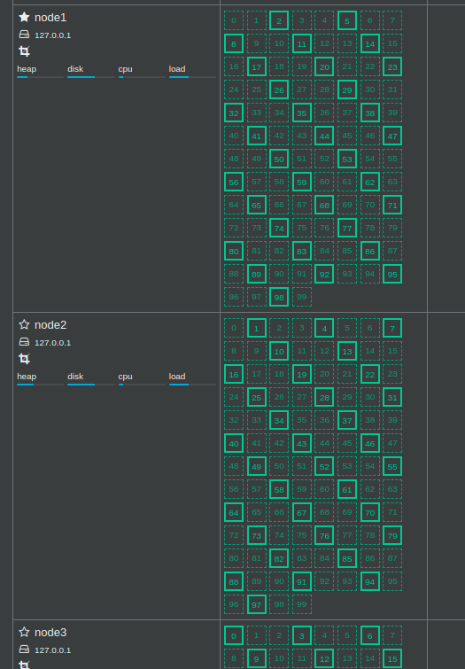

### start a cluster on a single host for local development

```bash
bin/elasticsearch -E cluster.name=c1 -E node.name=node1 -E path.data=node1_data -d
bin/elasticsearch -E cluster.name=c1 -E node.name=node2 -E path.data=node2_data -d
bin/elasticsearch -E cluster.name=c1 -E node.name=node3 -E path.data=node3_data -d
```

### plugin management

```
bin/elasticsearch-plugin list # check installed plugin on a node by using command line
curl http://localhost:9200/_cat/plugins  # check installed plugin on a node by using curl
bin/elasticsearch-plugin install analysis-icu  # install a plugin 
```
### cluster node

```
get _cat/nodes?v 

ip        heap.percent ram.percent cpu load_1m load_5m load_15m node.role master name
127.0.0.1           21          98  11    0.77    1.19     1.19 dilm      *      node1
127.0.0.1           21          98  11    0.77    1.19     1.19 dilm      -      node3
127.0.0.1           15          98  11    0.77    1.19     1.19 dilm      -      node2


```
#### node metadata

- node name
- node id

#### node role
- master node
    - only master node can change the cluster state information(even though all nodes has a copy of cluster information)
        - cluster information
            - all nodes information
            - all indices informtion, and its settings and mappings
            - shard routing information
- master eligible node
    - only master eligible nodes can participate in the leader selection and becomes a master node if it wins.
    - by default, every node is master eligible
    - set `node.master: false` to disable this role
- data node: keeping the shards and replicas.
- ingest node: pre-process documents before the actual document indexing happens
    - all nodes enable ingest by default
- coordinating node: receive the request from client, distribute the request to other nodes, collect the results and send it back to the client.
    - by default, every node is cooridinating node. to create a coordinating __ONLY__ node, set below:
        - node.master=false
        - node.data=false
        - node.ingest=false.


#### hot&warm node

日志类型的应用, 旧日志用配置低的机型, 用于节省成本.

see https://www.elastic.co/blog/implementing-hot-warm-cold-in-elasticsearch-with-index-lifecycle-management

### cluster health

```
GET /_cluster/health
GET /_cluster/health?level=shards
GET /_cluster/health/movies,kibana_sample_data_flights
GET /_cluster/health/movies?level=shards
```
green: 主分片和副本都正常分配
yellow: 主分片正常分配, 副本分配未能正常分配
red: 有主分片未能正常分配, 例如,在磁盘容量少于15%时尝试创建index

### shards and replicas

the docs inside of an index seperated into different shards

Each Elasticsearch shard is a Lucene index.

below will tell the detailed view of what nodes contain which shards, and it will tell if it’s a primary or replica
```
GET _cat/shards?v

index                           shard prirep state    docs   store ip        node
movies                          0     p      STARTED  9743   1.4mb 127.0.0.1 node3
movies                          0     r      STARTED  9743   1.3mb 127.0.0.1 node2
.monitoring-kibana-7-2019.11.15 0     r      STARTED    87 238.6kb 127.0.0.1 node3
.monitoring-kibana-7-2019.11.15 0     p      STARTED     3 133.6kb 127.0.0.1 node1
.kibana_task_manager_1          0     r      STARTED     2  12.5kb 127.0.0.1 node2
.kibana_task_manager_1          0     p      STARTED     2  12.5kb 127.0.0.1 node1
kibana_sample_data_ecommerce    0     p      STARTED  4675   4.5mb 127.0.0.1 node3
kibana_sample_data_ecommerce    0     r      STARTED  4675   4.8mb 127.0.0.1 node2
kibana_sample_data_flights      0     r      STARTED 13059   6.3mb 127.0.0.1 node3
kibana_sample_data_flights      0     p      STARTED 13059   6.3mb 127.0.0.1 node1
.apm-agent-configuration        0     p      STARTED     0    283b 127.0.0.1 node3
.apm-agent-configuration        0     r      STARTED     0    283b 127.0.0.1 node2
kibana_sample_data_logs         0     p      STARTED 14074  11.1mb 127.0.0.1 node2
kibana_sample_data_logs         0     r      STARTED 14074  11.3mb 127.0.0.1 node1
.kibana_1                       0     p      STARTED   167     1mb 127.0.0.1 node3
.kibana_1                       0     r      STARTED   167     1mb 127.0.0.1 node1
.monitoring-es-7-2019.11.15     0     p      STARTED    93     3mb 127.0.0.1 node2
.monitoring-es-7-2019.11.15     0     r      STARTED  1521   3.4mb 127.0.0.1 node1

```


shard分类
- primary shard
    - 解决水平扩展的问题, 通过主分片,可以将一个index中的数据分散到不同的节点中
    - 在创建index的时候就设定
    - 分片数一旦指定, 将不能修改, 除非re-index
        - 原因: 各个节点通过分片个数寻找doc在那个节点(分片)上.
- replica shard
    - 是一个主分片的拷贝
    - 解决数据高可用的问题, 当某个住分片丢失或者损坏时, 不会导致数据丢失, 也不会影响对分片的读写( horizontally split/scale your content volume)
    - 副本个数可以动态改变
    - 增加副本数量, 可以提高读取的吞吐量.( distribute and parallelize operations across shards)

the master node will not assign a primary shard to the same node as its replica.

the master node will not assign two replicas of the same shard to the same node. 

考虑三个节点时:
- 每个index设定一个shard, 每个shard有一个replica: shard和replica可以分配到不同的node上, 集群 green
- 每个index设定一个shard, 每个shard有三个replica: 有一个replica节点无法分配, 因为该index的shard和另外两个replica已经占用了所有节点, 集群 yellow
- 每个index设定四个shard, 每个shard有两个replica: 所有shard都可以分配
- 每个index设定四个shard, 每个shard有三个replica: 有四个replica节点无法分配, 每一个primary shard的一个replica无法分配, 集群 yellow
- 每个index设定100个shard, 每个shard有两个replica: 所有shard都可以分配




keep in mind: N(Node) >= R(Replica) + 1, shard 的个数不会影响allocation的成败, 但是 replica会.


use `get /_cluster/allocation/explain?pretty` to see why replica are not allocated.

shard(主分片) 容量规划

- shard 数量太小
    - 因为不能动态调整分片数量, 当数据越来越多时,数据只能分布在现有的分片中, 最终导致每个分片的数据量过大
        - 数据量过大会有什么问题?
            - 数据分配时更加耗时
- shard 数量过大
        - 
            
            
https://stackoverflow.com/questions/15694724/shards-and-replicas-in-elasticsearch

https://www.elastic.co/guide/en/elasticsearch/reference/6.2/_basic_concepts.html

### Running a cluster without replicas
https://discuss.elastic.co/t/running-a-cluster-without-replicas/129846

### segment

https://stackoverflow.com/questions/15426441/understanding-segments-in-elasticsearch
> OSs heavily cache data you write to a file. If the OS enforced every write to hit the drive, things would be very slow. fsync (among other things) allows you to control when the data should hit the drive.

### flush and fsync

https://www.elastic.co/guide/en/elasticsearch/reference/current/indices-flush.html
http://blog.httrack.com/blog/2013/11/15/everything-you-always-wanted-to-know-about-fsync/

### refresh and flush
https://qbox.io/blog/refresh-flush-operations-elasticsearch-guide

### segment merge
 every search request has to check every segment in turn; the more segments there are, the slower the search will be.

Elasticsearch solves this problem by merging segments in the background. Small segments are merged into bigger segments

https://www.elastic.co/guide/en/elasticsearch/guide/current/merge-process.html

### when new documents are searchable
While indexing, the refresh process creates new segments and opens them for search.

The merge process selects a few segments of similar size and merges them into a new bigger segment in the background. This does not interrupt indexing and searching.


### tunning

https://www.ebayinc.com/stories/blogs/tech/elasticsearch-performance-tuning-practice-at-ebay/
https://www.oreilly.com/ideas/10-elasticsearch-metrics-to-watch
https://www.elastic.co/guide/en/elasticsearch/guide/master/indexing-performance.html


### troubleshooting

#### 429 error
the cluster is busy
