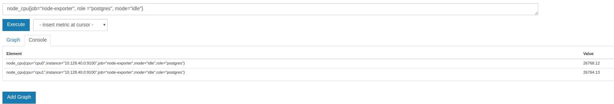
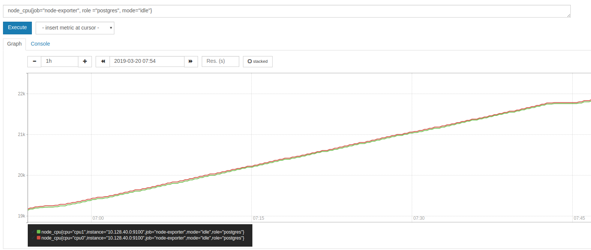
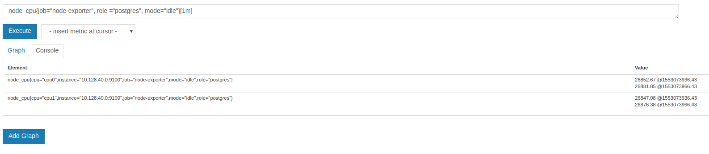
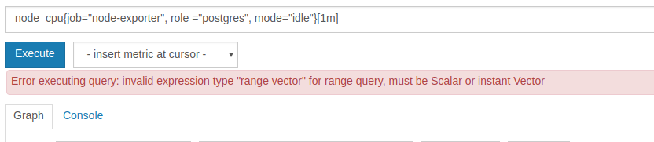
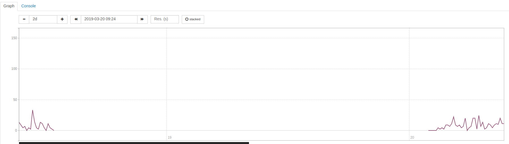

### Expression language data types

#### Instant vector
A set of time series containing a single value for each time series, all sharing the same timestamp. This results in an instant vector containing elements for all time series that have this metric name

```
http_requests_total
http_requests_total{environment=~"staging|testing|development",method!="GET"}
```


> * note the console only show the latest value





#### Range vector 
a set of time series containing a range of data points over time for each time series.
the range vector cannot be displayed in the graph

```
http_requests_total{job="prometheus"}[5m]
```



> * note the console only show the latest value



#### Scalar 
a simple numeric floating point value


### Functions

https://prometheus.io/docs/prometheus/latest/querying/functions/

####  Aggregation functions

the aggregation functions work on the instant vectors.

- sum (calculate sum over dimensions)
- min (select minimum over dimensions)
- max (select maximum over dimensions)
- avg (calculate the average over dimensions)
- count (count number of elements in the vector)

```
max (node_cpu{job="node-exporter", role ="postgres"}) 
# putput
{}	27962.3
```
use `without` to remove the listed labels from the result vector, while all other labels are preserved the output. `by` does the opposite and drops labels that are not listed in the by clause

```
max (node_cpu{job="node-exporter", role ="postgres"})  by(mode, role)
#output
{mode="user",role="postgres"}	4413.6
{mode="guest",role="postgres"}	0
{mode="guest_nice",role="postgres"}	0
{mode="irq",role="postgres"}	0.03
{mode="softirq",role="postgres"}	20.06
{mode="system",role="postgres"}	356.1
{mode="idle",role="postgres"}	27994.92
{mode="iowait",role="postgres"}	86.92
{mode="nice",role="postgres"}	4.44
{mode="steal",role="postgres"}	41.32

max (node_cpu{job="node-exporter", role ="postgres"})  without(mode, role)
#output
{cpu="cpu0",instance="192.168.1.1:9100",job="node-exporter"}	27996.07
{cpu="cpu1",instance="192.168.1.2:9100",job="node-exporter"}	27993.53
```

#### other common used

##### increase(range-vector)

increase should only be used with counters.

it calculates the changes in the time series in the range vector. 

for example:
```
(get_profile_api{app="app1"} [2m]  offset 5m)
#outputs
get_profile_api{app="app1", instance="10.x.x.x:xxxx",job="app"}	848 @1553077126.088
                                                                848 @1553077156.088
                                                                850 @1553077186.088
                                                                850 @1553077216.088
                                                              
increase (get_profile_api{app="app1"} [2m]  offset 5m)
get_profile_api{app="app1", instance="10.x.x.x:xxxx",job="app"}	2.6
```
the 2.6  =  (850-848) * (2 * 60) ÷ (1553077216-1553077126)

it can also break in monotonicity (such as counter resets due to target restarts) are automatically adjusted for).



#### rate(range-vector)

`increase()` is a convenience function which returns the total across the time period. So for example increase(my_counter_total[1h]) would return the increase in the counter per hour.

rate() returns per second values. in the last expample result of `rate (get_profile_api{app="app1"} [2m]  offset 5m) ` is 0.02 , 0.02 = (850-848)  ÷ (1553077216-1553077126)

#### irate(range-vector)
similar to the `rate()` but based on the last two data points. in the last expample result of `irate (get_profile_api{app="app1"} [2m]  offset 5m) ` is 0 

#### irate vs rate

https://www.robustperception.io/irate-graphs-are-better-graphs

`irate()` only looks at the last two samples and is useful for high precision graphs over short time frames, that is, wants to pay attention to the sudden changes.

prefer rate for alerting to avoid alerts of sudden changes.
